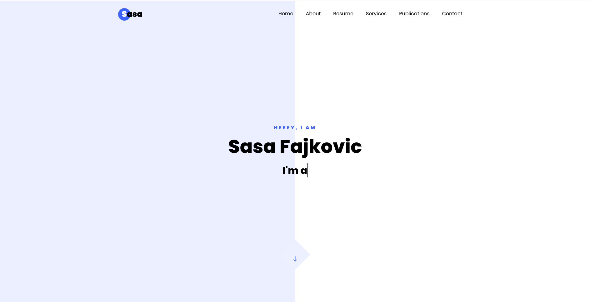

## New year, new me (and other nonsense)

As 2024 was coming to an end, and 2025 about to kick off and having a few days of free time, I decided to use the opportunity and revamp my personal website by doing a complete redesign and add a blog section. So here we are now and let's see how this journey will go.

Will this effort be justified, or just be another blob in the "New year, new me" bucket, only time will tell. One thing that is certain though, the outcome is fully under my control. If I will be continuously posting blog posts (at least once a month), it's a success. If I will stop posting, then my idea is a failure and the effort to create this website will not be justified.

Only time will tell, but at least I know the outcome is fully under my control. Whichever the outcome will be, it will be a learning for sure. Hopefully, I will mark this 2025 goal as "completed successfully" and have at least 12 posts by EOY (end of year).

## Why?

Gaining a lot of technical and business knowledge over the years, there just might be an idea or two worth sharing. After all, everything I learned is in one way or another due to being exposed to communities with smart and experienced people not being afraid to be challenged and challenge back. 

Often, I would find myself re-evaluating my thoughts after having discussions. The ability to change your stand based on the new information, while sounding like a completely reasonable thing to do, is often a trait very hard to find. Personally, I believe this is one of the key pillars of continuous learning and outgrowing yourself each year and getting ahead of the curve.

### Blog section purpose

The blog posts are meant to then serve 2 purposes:
- Give back to the community and hopefully inspire some new ideas
- Opportunity to self-reflect and re-evaluate my stands, thoughts and ideas

Given the experience in various areas in the last decade or so, I believe there just might be a thing or two worth sharing.

# Thank you

To everyone who has impacted me directly or indirectly, with great ideas and horrible ones, being there to make my life better or causing more problems than bringing joy... I wish to say <b>thank you</b>! 

Like it or not, you're all part of my journey (for better and for worse), learnings, mistakes and improvements.

And here's a screenshot of the old website just as a memory. You've served me well dear friend :) 

